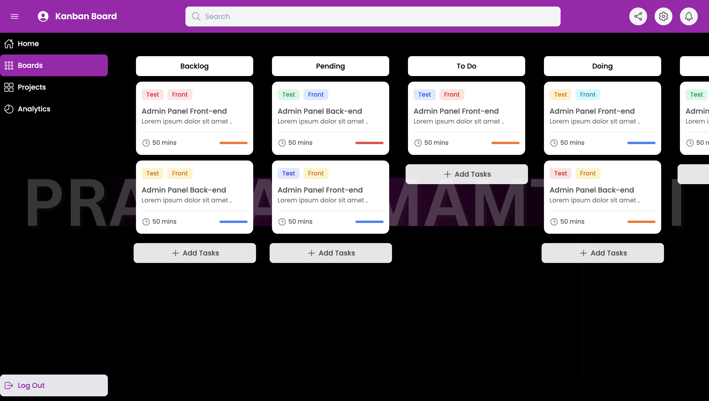

# Kanban Board 🗓️

This is a React + Vite based application.
It allows student to add their assignments or tasks on the Kanban board and manage its progress by dragging and dropping the tasks from one section to another. 
The idea was to create a virtual Kanban Board that allows students to move their sticky notes around but digitally.

**Skills used**
- React
- Tailwind CSS
- Javascript




# Installation ⚙️
To get this React application running here are the steps you should follow:
```npm install
npm create vite@latest
cd <project-name>
npm install
npm run dev
npm install yarn
yarn run dev --host
```
After this follow the localhost link to see the website


# References Used 🌐
- For icons: https://ionic.io/ionicons
- For icons: https://reactnativeelements.com/docs/1.2.0/icon


